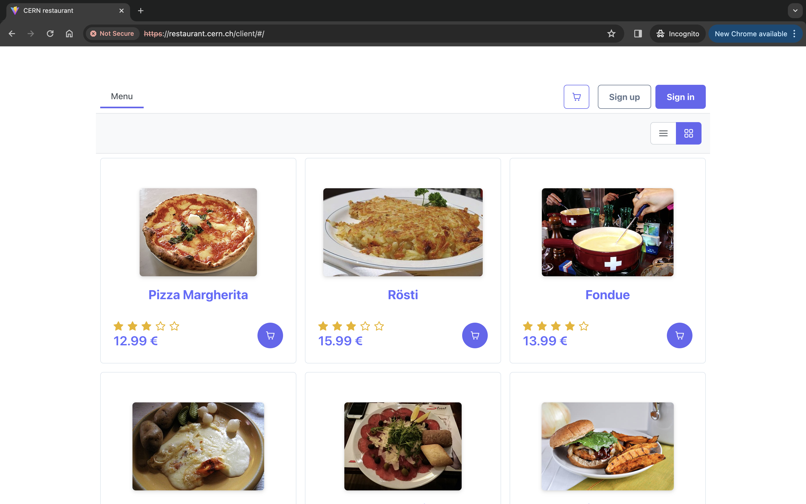

# DevOps coding challenge

## Introduction

You have been given a restaurant web application that has been developed using FastAPI and Vue.js. Unfortunately, the development environment is missing! Furthermore, the team would really like to deploy it in a Kubernetes environment for production.
Hence, it is your task to first containerize the development environment and then create configuration files to deploy the entire stack in a Kubernetes cluster.

## Presentation of the web application

The application emulates a simple online food ordering platform. It allows users to create an account, order meals, view their order history, and leave a review for every meal in their order history.

Screenshot of the application's interface:



The application consists of 3 parts:

- A postgres database
- A REST API based on FastAPI
- A frontend based on Vue.js

The code for these parts is provided by us, so you do not need to implement them yourself!

## Instructions

### A. Requirements

You will need to have [Docker](https://docs.docker.com/engine/install/) and [Minikube](https://minikube.sigs.k8s.io/docs/start/) installed on your machine. Optionally, you might need a GitLab account should you decide to host and submit your solution via [gitlab.com](https://gitlab.com) and a Docker Hub account if you want to push your images to [Docker Hub](https://hub.docker.com/) (see below: [C. Continuous integration](#c-continuous-integration) and [Submission](#submission)).

### B. Containerise the development environment

There is currently no containerised development environment so every developer from the team relies on his local installation of node, npm, python, postgres, etc.
Your first task is to containerize the full stack using `Docker` and `Docker compose` by following these steps:

⚠️ **NOTE**: Do not add any additional libraries/dependencies! If necessary, you are allowed to bump package versions.

1. Containerize the backend (i.e. the `server` folder). For this, use the empty `Dockerfile` provided in the root of this repository. Please use the [official Postgres image](https://hub.docker.com/_/postgres) from [Docker Hub](https://hub.docker.com/) for your database. Additionally, there is `initdb.sql` dump file inside the `database` folder which you should use to populate the database. Also, take note that you might need to create a volume to persist the database data between container restarts.

    The backend relies on the following environment variables:

    ```bash
    DB_HOST=
    DB_PORT=
    DB_DATABASE=
    DB_USERNAME=
    DB_PASSWORD=
    ```

    These variables are not defined and you are free to choose their values (and to add/remove environment variables as you like).

    ⚠️ **HINT:** the backend is using [Pydantic](https://docs.pydantic.dev/1.10/usage/settings/) to read defined environment variables. For example, the file `server/config.py` is reading the environment to retrieve the database related variables.

2. Containerize the frontend (i.e. the `client` folder). For this, use the empty `Dockerfile` provided in the `client` folder.

    The frontend relies on the following environment variables:

    ```bash
    CERN_RESTAURANT_CLIENT_PORT=
    CERN_RESTAURANT_CLIENT_PREFIX=
    VITE_BACKEND_URL=
    ```

    These variables are not defined and you are free to choose their values (and to add/remove environment variables as you like).

    ⚠️ **HINT:** the frontend is using vite as bundler and according to the [vite documentation](https://vitejs.dev/guide/env-and-mode#env-files), only variables prefixed by `VITE_` are injected and can be used through `import.meta.env.<YOUR_VARIABLE_NAME>`.

3. Create a compose file that will run the backend, database, and frontend containers together in development mode.
4. Add a reverse proxy container to the compose file which will route requests to the backend and frontend containers. This way one can access the frontend application via `http://localhost:PORT/client` and the backend via `http://localhost:PORT/api/docs`. In order to achieve this, we recommend using the official [Traefik](https://hub.docker.com/_/traefik) or [Nginx](https://hub.docker.com/_/nginx) images from [Docker Hub](https://hub.docker.com/).
5. Add SSL support to the reverse proxy container. The reverse proxy should be able to handle both HTTP and HTTPS requests. For this, you can use the self-signed certificates provided in the `development-certs` folder. Like this, one should be able to access the frontend application via `https://localhost:PORT/client` and the backend via `https://localhost:PORT/api/docs`.
6. Implement hot code reloading by using vite's and uvicorn's native capabilities for both backend and frontend containers (the reverse proxy should be able to handle websocket connections used for hot reload on the frontend). This way, when code changes are saved, the containers should automatically reload the code live with the latest changes. **Frontend Hint:** modify the configuration inside the `client/vite.config.js` file.

### C. Continuous integration

Your next task is to write a `gitlab-ci.yml` file for configuring continuous integration.
If you like, you can run it using a GitLab account, but that is optional.
We will mainly assess the content of the `gitlab-ci.yml` in either case.

The GitLab pipeline should run these stages:

- A `test` stage that will run the tests for the frontend (use `npm run test`) and for the backend (use `python -m pytest`).
- A `build` stage that will build Docker images for both frontend and backend.
    - Optional: Use this build stage to push those images to [Docker Hub](https://hub.docker.com/).
- Modify your `gitlab-ci.yml` file to automatically trigger the pipeline on the `main` branch and to manually trigger the pipeline on other branches.

### D. Kubernetes

Your last task is to set up and run a Kubernetes cluster using [Minikube](https://minikube.sigs.k8s.io/docs/start/).

Once your Kubernetes cluster is running, deploy the full stack (with **TLS**) in a Kubernetes cluster. One way to split this task is:

- Deploy the database
- Deploy the backend
- Deploy the frontend
- Add a reverse proxy to make the API accessible through the route `/api` and the client accessible through the route `/client` (similar to the development environment)
- Add TLS to support the `https` protocol

You are free to use Docker images from wherever you want (e.g. Docker Hub or locally via Minikube command `minikube image build`)

⚠️ **NOTE:** Please make sure that you include steps for us to reproduce your solution (e.g. by providing a `README.md`). 

## Submission and deadline

Submit your solution before the deadline either as GitLab repostiory or by uploading your repository as zip file:

- Via [gitlab.com](https://gitlab.com) repository:
    - [ ] Add the following members to your repository with the **Reporter** role : `@erwanlfrt` , `@orfeas.zografos`,  and `@kevin_kessler` (note the underscore!)
    - [ ] Share the link of your repository by eMail to [kevin.timo.kessler@cern.ch, orfeas.zografos@cern.ch, and erwan.le.forestier@cern.ch](mailto:kevin.timo.kessler@cern.ch,orfeas.zografos@cern.ch,erwan.le.forestier@cern.ch).

- Via CERNBox as zip file:
    - [ ] The zip file should contain the entire repository, including your .git folder.
    - [ ] Please name your zip file by the following format: firstname_lastname.zip, where firstname is your first name and lastname is your last name.
    - [ ] Upload the zip file to [https://cernbox.cern.ch/s/2T1YMegfIlA7y6e](https://cernbox.cern.ch/s/2T1YMegfIlA7y6e) (password: devops-tech-2024)
 
⏰ **Deadline**: Tuesday 30th April 2024 before 09:00 AM Geneva time. 

⚠️ **NOTE:** any submissions or modifications to your repository that are made after the deadline will not be considered.


